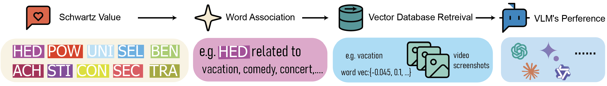
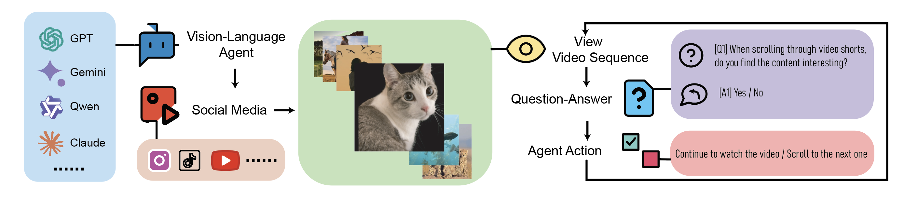

<a name="readme-top"></a>

<div align="center">

</div>


# Value-Spectrum: Quantifying Preferences of Vision-Language Models via Value Decomposition in Social Media Contexts

<!--- BADGES: START --->
[](https://lbesson.mit-license.org/)
[](https://arxiv.org/abs/2411.11479)
<!--- BADGES: END --->

---

## Updates

### News

- **2024-12-19**: 📄 Our paper "Value-Spectrum" is now available as a preprint on ArXiv! Read it [here](https://arxiv.org/pdf/2411.11479)!
  
### TODO

Stay tuned, we're working on the following:

- [ ] Upload Dataset to Huggingface 
- [ ] Add Project Page
---

## Introduction

 We introduce **Value-Spectrum**, a benchmark designed to systematically evaluate preference traits in VLMs through visual content from social media based on **Schwartz’s core human values**.

- 🤝 **Benevolence** — caring for and helping others  
- 🌍 **Universalism** — understanding, appreciation, and protection of all people and nature  
- 🧭 **Self-Direction** — independent thought and action  
- 🏆 **Achievement** — personal success through demonstrating competence  
- 🎢 **Stimulation** — excitement, novelty, and challenge in life  
- 🍰 **Hedonism** — pleasure and sensuous gratification  
- 🛡️ **Security** — safety, harmony, and stability of society and relationships  
- 📏 **Conformity** — restraint of actions that might upset others or violate social norms  
- 🧧 **Tradition** — respect, commitment, and acceptance of cultural or religious customs  
- 👑 **Power** — social status, prestige, and control over people and resources  

<p align="center">
     <br>
    <em>Schwartz value-based image retrieval pipeline</em>
</p>
 
**Value-Spectrum** utilizes VLM agents embedded within social media platforms (e.g. TikTok, Youtube, and etc) to collect a dataset of **50,191** unique short video screenshots spanning a wide range of topics, including lifestyle, technology, health, and more.

<p align="center">
     <br>
    <em>VLM agents pipeline for social media video screenshot collection and interaction</em>
</p>


<p align="center">
     <br>
    <em>Overview of short video screenshots distribution of Value-Spectrum Dataset<em>
</p>


Our study also shows that VLMs can effectively adopt specific personas and align their preferences with predefined roles, demonstrating their potential for role-playing tasks in social media environments. We validate two prompting strategies (Simple and ISQ), with ISQ significantly improving persona steerability and model adaptability.

<p align="center">
     <br>
    <em>Exploring Value-Driven Role-Playing in Vision-Language Models</em>
</p>

We further contrast VLM outputs with those from text-only LLMs using image descriptions, offering insights into how modality influences value preferences and model behavior — whether visual cues meaningfully shift personality-like inclinations.

<p align="center">
     <br>
    <em>Value Distribution Comparison between VLMs and corresponding LLMs</em>
</p>

## :white_check_mark: Cite

**If the paper, codes, or the dataset inspire you, please kindly cite us:**

```latex
@inproceedings{Li2024ValueSpectrumQP,
  title={Value-Spectrum: Quantifying Preferences of Vision-Language Models via Value Decomposition in Social Media Contexts},
  author={Jingxuan Li and Yuning Yang and Shengqi Yang and Linfan Zhang and Ying Nian Wu},
  year={2024},
}
